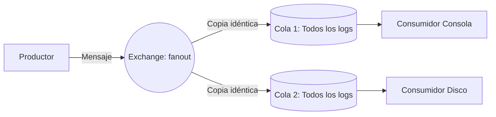
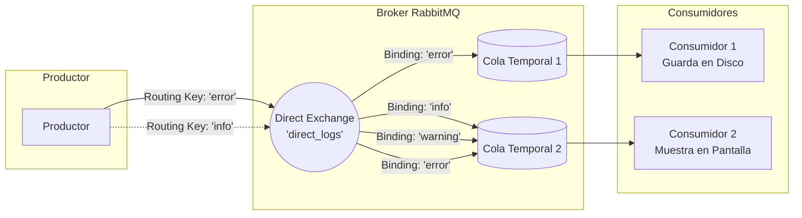
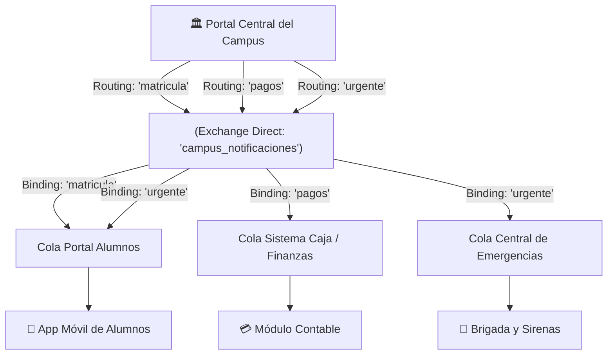

# Presentación: RabbitMQ Tutorial 4 - Routing (Direct Exchange)
**Asignatura:** Sistemas Distribuidos  
**Tecnología:** RabbitMQ + Node.js (`amqplib`)  
**Tema:** Enrutamiento Selectivo de Mensajes con Exchange Directo  

---

## Índice de la Presentación

1. [Diapositiva 1: Portada y Objetivos](#diapositiva-1-portada-y-objetivos)
2. [Diapositiva 2: El Problema con el Modelo Anterior (Fanout)](#diapositiva-2-el-problema-con-el-modelo-anterior-fanout)
3. [Diapositiva 3: La Solución - Direct Exchange](#diapositiva-3-la-solución---direct-exchange)
4. [Diapositiva 4: Conceptos Clave (Routing Key vs Binding Key)](#diapositiva-4-conceptos-clave-routing-key-vs-binding-key)
5. [Diapositiva 5: Enlaces Múltiples (Multiple Bindings)](#diapositiva-5-enlaces-múltiples-multiple-bindings)
6. [Diapositiva 6: Análisis del Código - Productor (`emit_log_direct.js`)](#diapositiva-6-análisis-del-código---productor-emit_log_directjs)
7. [Diapositiva 7: Análisis del Código - Consumidor (`receive_logs_direct.js`)](#diapositiva-7-análisis-del-código---consumidor-receive_logs_directjs)
8. [Diapositiva 8: Caso de Uso Contextualizado - Sistema Universitario](#diapositiva-8-caso-de-uso-contextualizado---sistema-universitario)
9. [Diapositiva 9: Demostración Práctica en Vivo](#diapositiva-9-demostración-práctica-en-vivo)
10. [Diapositiva 10: Conclusiones y Ventajas](#diapositiva-10-conclusiones-y-ventajas)

---

## Diapositiva 1: Portada y Objetivos

### Título
**Enrutamiento Inteligente con RabbitMQ: Direct Exchange**

### Subtítulo
*Patrón Productor-Consumidor Selectivo en Sistemas Distribuidos*

### Objetivos de la sesión
- Comprender las limitaciones del modelo Broadcast / Fanout.
- Aprender cómo un **Direct Exchange** toma decisiones de enrutamiento exactas.
- Distinguir con claridad entre **Routing Key** (clave de enrutamiento) y **Binding Key** (clave de enlace).
- Ver la implementación real en JavaScript y un caso de aplicación en nuestro campus universitario.

> **Guion para el expositor:**  
> *"Buenos días compañeros y profesor. Hoy vamos a exponer el Tutorial 4 de RabbitMQ: Routing. En sesiones pasadas vimos colas de trabajo y el patrón Publish/Subscribe con Fanout. Hoy daremos el siguiente paso lógico: cómo hacer que los consumidores no reciban todo el flujo indiscriminadamente, sino únicamente los datos que les competen."*

---

## Diapositiva 2: El Problema con el Modelo Anterior (Fanout)

### ¿Qué hacíamos en el Tutorial 3?
En el modelo *Publish/Subscribe*, el exchange era de tipo `fanout`.



### Inconvenientes del modelo Fanout:
- **Desperdicio de recursos:** Si el consumidor a disco solo necesita almacenar errores críticos (`error`), se ve obligado a recibir y descartar manualmente millones de mensajes de tipo `info`.
- **Falta de granularidad:** El productor no puede segmentar a qué audiencia va dirigida la información.

---

## Diapositiva 3: La Solución - Direct Exchange

### ¿Cómo funciona el Direct Exchange?
El algoritmo es determinista y directo:  
Un mensaje se envía a las colas cuya **Binding Key** coincide **exactamente** con la **Routing Key** que acompaña al mensaje.



---

## Diapositiva 4: Conceptos Clave (Routing Key vs Binding Key)

| Concepto | ¿Quién lo define? | ¿Dónde vive? | Propósito |
| :--- | :--- | :--- | :--- |
| **Routing Key** | El **Productor** | En los metadatos del mensaje | Es la "etiqueta" o categoría asignada al publicar el mensaje. |
| **Binding Key** | El **Consumidor** | En la relación entre Cola y Exchange | Es el "criterio de interés" con el que la cola se suscribe al exchange. |
| **Direct Exchange** | Configuración compartida | En el broker RabbitMQ | Realiza la comparación booleana: `RoutingKey === BindingKey`. |

> **Regla de oro:** Si un mensaje llega con una `Routing Key` que no coincide con ninguna `Binding Key` configurada en ninguna cola, el mensaje se **descarta silenciosamente**.

---

## Diapositiva 5: Enlaces Múltiples (Multiple Bindings)

RabbitMQ permite dos tipos de flexibilidad esenciales:

1. **Múltiples colas con la misma clave:**  
   Si la Cola A y la Cola B tienen la Binding Key `'error'`, un mensaje con Routing Key `'error'` se entrega a ambas colas (comportándose localmente como un *fanout* para esa clave).
2. **Una sola cola con múltiples claves:**  
   Una misma cola puede estar enlazada con `'info'`, `'warning'` y `'error'`. Recibirá cualquier mensaje que coincida con cualquiera de esas tres claves.

---

## Diapositiva 6: Análisis del Código - Productor (`emit_log_direct.js`)

```javascript
// 1. Declarar el exchange de tipo 'direct'
const exchange = 'direct_logs';
await channel.assertExchange(exchange, 'direct', { durable: false });

// 2. Extraer severidad y mensaje de los argumentos de consola
const severity = args[0] || 'info';
const msg = args.slice(1).join(' ') || 'Hello World!';

// 3. Publicar pasando la severidad como Routing Key
channel.publish(exchange, severity, Buffer.from(msg));
```

### Aspectos a destacar en la exposición:
- En `channel.publish(exchange, routingKey, buffer)`, el segundo parámetro ya **no es una cadena vacía**, sino la clave que determinará el destino.
- El productor **no conoce qué colas existen** ni cuántos consumidores están escuchando (desacoplamiento total).

---

## Diapositiva 7: Análisis del Código - Consumidor (`receive_logs_direct.js`)

```javascript
// 1. Crear una cola temporal y exclusiva para este proceso
const q = await channel.assertQueue('', { exclusive: true });

// 2. Crear un Binding por cada severidad pasada por consola
for (const severity of args) {
  await channel.bindQueue(q.queue, exchange, severity);
}

// 3. Consumir mensajes
channel.consume(q.queue, (msg) => {
  console.log(` [x] ${msg.fields.routingKey}: '${msg.content.toString()}'`);
}, { noAck: true });
```

### Aspectos a destacar:
- La cola temporal (`exclusive: true`) se elimina automáticamente al cerrar el terminal.
- El bucle `for` permite que un único consumidor se suscriba a 1, 2 o todas las categorías dinámicamente.

---

## Diapositiva 8: Caso de Uso Contextualizado - Sistema Universitario

### Escenario: Plataforma de Comunicaciones de Nuestra Universidad
En un campus universitario, existen distintos departamentos y aplicaciones interesadas en diferentes eventos:



### Comportamiento del enrutamiento:
1. Si se emite un evento de **`matricula`**: Llega **solo** a los alumnos.
2. Si se emite un comprobante de **`pagos`**: Llega **solo** a Finanzas/Caja.
3. Si ocurre una alerta **`urgente`** (ej. sismo o suspensión de clases): Llega a los **Alumnos** y a la **Brigada de Seguridad**.

---

## Diapositiva 9: Demostración Práctica en Vivo

### Pasos para la demostración ante el curso:

#### Paso 1: Levantar los consumidores en terminales separadas
- **Terminal 1 (Seguridad del Campus):**
  ```bash
  npm run campus:seguridad
  ```
- **Terminal 2 (Finanzas / Caja):**
  ```bash
  npm run campus:caja
  ```
- **Terminal 3 (Portal Estudiantil):**
  ```bash
  npm run campus:alumnos
  ```

#### Paso 2: Emitir eventos en una 4ta terminal
- **Emitir Pago:**
  ```bash
  npm run campus:emit:pagos
  ```
  *(Se observa que SOLO la Terminal 2 reacciona).*

- **Emitir Noticia de Matrícula:**
  ```bash
  npm run campus:emit:matricula
  ```
  *(Se observa que SOLO la Terminal 3 reacciona).*

- **Emitir Alerta Urgente:**
  ```bash
  npm run campus:emit:urgente
  ```
  *(Se observa que las Terminales 1 y 3 reaccionan simultáneamente, mientras que Caja la ignora).*

---

## Diapositiva 10: Conclusiones y Ventajas

1. **Eficiencia en Red y Cómputo:** Los nodos consumidores no gastan ciclos de CPU descartando mensajes irrelevantes en memoria de aplicación; el descarte lo hace el broker en el core de red.
2. **Escalabilidad Horizontal Selectiva:** Podemos escalar réplicas de los consumidores críticos (por ejemplo, el módulo de pagos) sin alterar al resto del sistema.
3. **Paso previo al Topic Exchange:** Cuando los patrones de filtrado requieren comodines más avanzados (ejemplo: `alumnos.sistemas.semestre6`), la base conceptual sigue siendo el enrutamiento por claves que aprendimos hoy.
